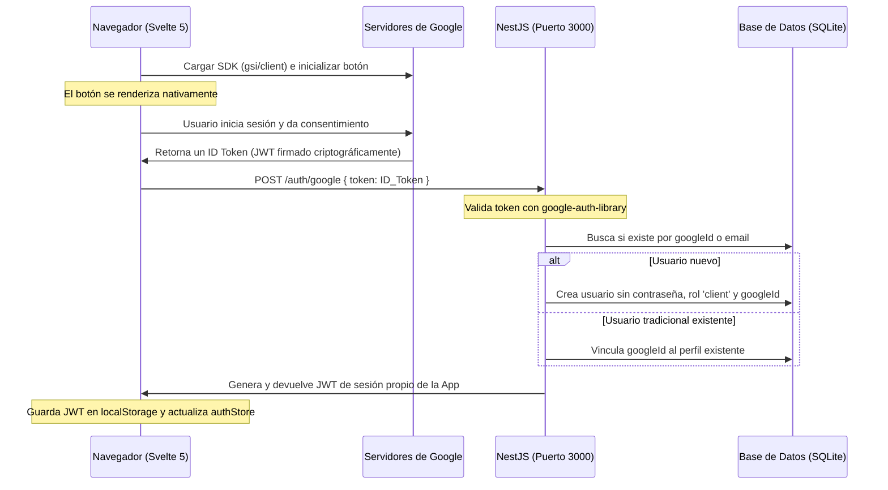

# Guía de Autenticación con Google (Google Sign-In)

Este documento detalla la arquitectura, el flujo de datos y la configuración requerida en la consola de Google Cloud para el funcionamiento de inicio de sesión con cuentas de Google en nuestra aplicación (**Svelte 5** + **NestJS** + **SQLite**).

---

## 1. Concepto y Flujo de Datos

El sistema implementa el **flujo guiado por el Frontend** (basado en credenciales ID Token). Este flujo evita redirecciones toscas del navegador y proporciona la experiencia de usuario más fluida en aplicaciones de página única (SPA).

### Diagrama del Flujo:



---

## 2. Configuración en la Consola de Google Cloud

Para que el inicio de sesión funcione, el backend y el frontend deben comunicarse con la infraestructura de Google mediante un **Client ID**. A continuación se detallan los pasos de configuración en **[Google Cloud Console](https://console.cloud.google.com/)**:

### A. Pantalla de Consentimiento de OAuth (OAuth Consent Screen)
Es la pantalla informativa que ve el usuario cuando decide vincular su cuenta de Google.
* **User Type (Tipo de usuario):** Seleccionar **Externo** (External).
* **Información Básica:** Ingresar el nombre de la app (ej. `Nest Svelte5 App`) y el correo de soporte.
* **Estado de publicación:** Inicialmente el proyecto estará en **Prueba (Testing)**.

### B. Usuarios de Prueba (Test Users)
> [!IMPORTANT]
> Mientras la aplicación esté en modo **Testing**, **Google solo permitirá iniciar sesión a las cuentas que agregues manualmente en esta lista.** Cualquier otro correo que intente acceder recibirá un error de acceso no autorizado.
* En la pestaña del Consentimiento, desplázate hasta **Usuarios de prueba (Test users)**.
* Agrega las cuentas de Gmail que usarás para depurar (ej. tu correo personal de desarrollo).

### C. Creación del ID de Cliente de OAuth (OAuth Client ID)
1. Ve al menú lateral -> **API y servicios** -> **Credenciales**.
2. Haz clic en **Crear credenciales** -> **ID de cliente de OAuth**.
3. Selecciona **Aplicación web** (Web application) como tipo de aplicación.
4. **Configura los Orígenes de JavaScript Autorizados:**
   Indica las URLs exactas desde donde se ejecutará tu aplicación web (Svelte). Esto le dice a Google que acepte solicitudes del botón de inicio de sesión:
   * `http://localhost:5173`
   * `http://127.0.0.1:5173`
5. **Configura las Redirecciones Autorizadas (Authorized Redirect URIs):**
   Aunque nuestro flujo de frontend lee el token directamente mediante un callback de JavaScript sin recargar la página, Google requiere tener configuradas las URIs de redirección correspondientes para dar validez al Client ID. Configura las mismas direcciones:
   * `http://localhost:5173`
   * `http://127.0.0.1:5173`
6. Al guardar, obtendrás el **Client ID** (que expone tu aplicación públicamente) y el **Client Secret** (que se mantiene seguro en el backend).

---

## 3. Implementación en el Código

### A. Frontend (`user-web`)
* **Inyección del SDK:** En [app.html](file:///data/data/com.termux/files/home/Nestjs-svelte5-lavapp/user-web/src/app.html) cargamos la librería cliente oficial de Google de forma asíncrona:
  ```html
  <script src="https://accounts.google.com/gsi/client" async defer></script>
  ```
* **Inicialización Visual:** En [login/+page.svelte](file:///data/data/com.termux/files/home/Nestjs-svelte5-lavapp/user-web/src/routes/login/+page.svelte), un `$effect` reactivo en el cliente verifica la carga del script e inicializa el botón nativo de Google pasándole nuestro `Client ID` y enlazándolo a la función de callback:
  ```typescript
  window.google.accounts.id.initialize({
    client_id: '133806765476-l4vlgdm105bauerb58l1u0t8g8k020u3.apps.googleusercontent.com',
    callback: handleGoogleCredentialResponse
  });
  window.google.accounts.id.renderButton(btnContainer, { theme: 'outline', size: 'large' });
  ```
* **Comunicación con el Backend:** El callback recibe el ID Token criptográfico y lo delega a [auth-store.svelte.ts](file:///data/data/com.termux/files/home/Nestjs-svelte5-lavapp/user-web/src/lib/features/auth/services/auth-store.svelte.ts) para realizar la petición `POST /auth/google`. Si el servidor lo aprueba, se recibe un JWT local que se guarda en el navegador.

### B. Backend (`user-api`)
* **Validación de Firma:** Usando `google-auth-library`, el backend verifica que el token de Google sea legítimo, haya sido emitido por Google y coincida con nuestro `Client ID`.
* **Coherencia y Seguridad en la Base de Datos:**
  * El campo `password` de la tabla `User` ahora es `nullable: true` (opcional) en SQLite.
  * Si un usuario se registra tradicionalmente (`POST /users`), el DTO `CreateUserDto` obliga a proveer contraseña mediante validaciones en el controlador.
  * Si inicia por Google (`POST /auth/google`), se usa la ruta OAuth donde no se pide contraseña, registrando directamente al usuario con su nombre de Google, correo electrónico y su `googleId` único.
  * Si el correo ya existía por un registro tradicional previo, la aplicación simplemente asocia el `googleId` a esa cuenta permitiendo que a partir de ese momento pueda ingresar por ambos métodos.
