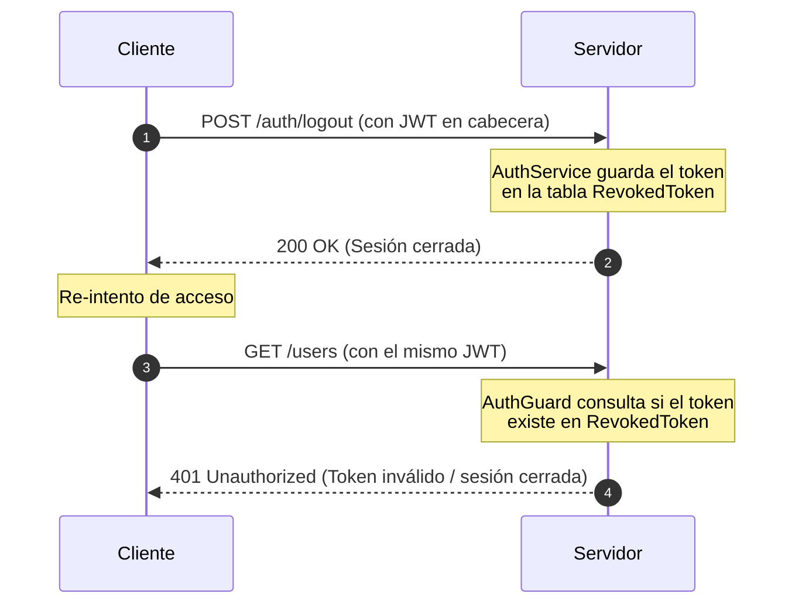

# Documentación Arquitectónica: Revocación de Tokens JWT (Logout Seguro)

Este documento detalla la justificación técnica, el diseño de la solución y las mejores prácticas en la industria para el cierre de sesión utilizando JSON Web Tokens (JWT) dentro del proyecto `user-api`.

---

## 1. El Dilema del Cierre de Sesión en JWT

En arquitecturas tradicionales basadas en cookies, el servidor gestiona las sesiones de manera **stateful** (con estado) guardando el ID de la sesión en memoria o en una base de datos. Para cerrar la sesión, el servidor simplemente borra ese registro y el usuario queda deslogueado.

En cambio, las arquitecturas basadas en JWT son por definición **stateless** (sin estado):
* El servidor firma digitalmente el token y lo entrega al cliente.
* El servidor **no mantiene ningún registro** de los tokens emitidos.
* En cada petición, el servidor solo verifica la firma y la fecha de expiración.

### El Riesgo de Seguridad:
Dado que el servidor no tiene memoria, si un usuario hace "logout" (lo cual solo borra el token en el navegador), el token original **sigue siendo criptográficamente válido** en el servidor hasta su fecha de expiración. Si un tercero roba o intercepta ese token antes del logout, podrá acceder a la API libremente.

---

## 2. Nuestra Solución: Lista Negra de Tokens (`RevokedToken`)

Para mitigar este riesgo de seguridad sin complejizar demasiado la arquitectura del backend en esta fase, implementamos un patrón de **Lista Negra de Tokens (Token Blacklist)**:

### Flujo de Funcionamiento:


### Componentes de la API:
1. **Entidad `RevokedToken`** ([revoked-token.entity.ts](file:///data/data/com.termux/files/home/user-api/src/auth/entities/revoked-token.entity.ts)):
   Tabla en SQLite donde persistimos temporalmente las firmas de los tokens que han solicitado el cierre de sesión explícito.
2. **Endpoint `/auth/logout`** ([auth.controller.ts](file:///data/data/com.termux/files/home/user-api/src/auth/auth.controller.ts)):
   Ruta protegida que extrae el token usado y lo envía a la base de datos de revocados a través de `AuthService.revokeToken()`.
3. **Guardián de Acceso `AuthGuard`** ([auth.guard.ts](file:///data/data/com.termux/files/home/user-api/src/auth/auth.guard.ts)):
   Interpreta la cabecera `Authorization`, verifica si el token está en la base de datos de revocados mediante `AuthService.isTokenRevoked()` y, de ser así, intercepta y rechaza la petición con una respuesta `401 Unauthorized`.

---

## 3. ¿Cómo Evitamos que se Llene la Base de Datos?

Uno de los mayores temores al usar este patrón es el crecimiento indefinido de la base de datos a medida que los usuarios inician y cierran sesión. En un entorno profesional, esto se soluciona con dos técnicas:

### A. Limpieza Automática basada en Expiración (TTL)
Un token solo necesita estar en la lista negra **mientras no haya expirado de forma natural**. Una vez que expira (por ejemplo, después de 60 segundos o 1 hora de emitido), el verificador criptográfico estándar del JWT lo rechazará automáticamente por "expirado", por lo que ya no hace falta tenerlo registrado en la blacklist.

En producción:
* Si se usa **Redis**, los tokens se guardan con un **TTL (Time-To-Live)** igual al tiempo restante de vida del token. Redis los borra automáticamente de la memoria RAM al expirar, manteniendo la base de datos limpia con costo de mantenimiento cero.
* Si se usa una base de datos relacional (como SQLite o PostgreSQL), se programa una tarea periódica (con NestJS `@nestjs/schedule` o un evento programado en SQL) para limpiar registros antiguos:
  ```typescript
  // Ejemplo conceptual de limpieza periódica (ej. cada hora o día)
  async cleanExpiredTokens() {
    await this.revokedTokenRepository.delete({
      // Borra todos los tokens creados hace más tiempo que la duración máxima del JWT
      createdAt: LessThan(new Date(Date.now() - JWT_EXPIRATION_TIME))
    });
  }
  ```

---

## 4. Alternativas en Producción a Gran Escala

Si la escala del proyecto crece a millones de usuarios activos, la industria suele migrar a la siguiente arquitectura alternativa:

### Access Tokens + Refresh Tokens (Estándar OAuth2)
* **Access Token**: Tiene una vida útil sumamente corta (5 a 15 minutos) y se guarda en memoria RAM del cliente. Al expirar tan rápido, no se implementa una blacklist en el servidor para ellos.
* **Refresh Token**: Tiene una vida útil larga (7 a 30 días) y se almacena seguro en la base de datos del servidor y en cookies `HttpOnly` del cliente.
* **Logout**: Al cerrar sesión, el servidor **elimina únicamente el Refresh Token** de su base de datos. Cuando el Access Token del cliente expira a los 5 minutos y este intenta renovarlo con el Refresh Token, el servidor lo rechaza, forzando un logout seguro y descentralizado con un impacto mínimo en recursos.
